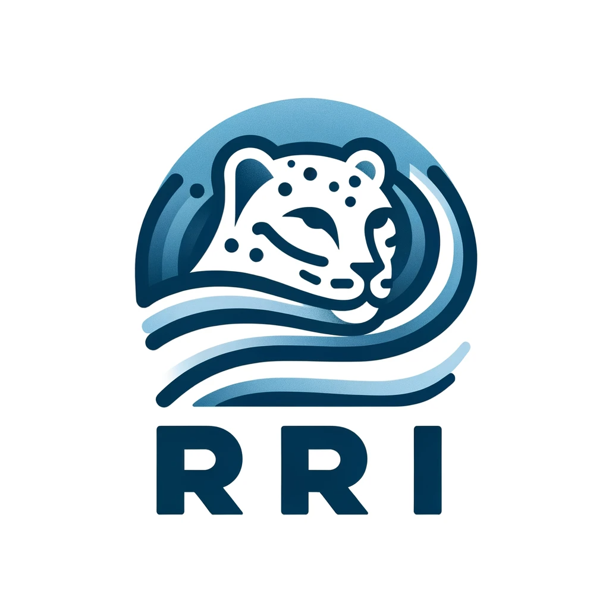

  

<h1 align="center">Roessner Restoration Initiative</h1>

  <strong>Stewardship · Sovereignty · Regeneration</strong>

  501(c)(3) nonprofit building conservation technology, leading field expeditions, 
  and designing regenerative economic systems for ecosystem protection.

  
  
  
  
  

---

### Featured

**[WhaleID](https://whaleid.org)** — v1 is live. The first AI system built for full-body whale photo identification. Six neural networks analyze six anatomical regions to identify individual humpback whales from any body part, any angle — especially underwater encounters that traditional fluke-matching can't process. Upload any whale photo for free at **[whaleid.org](https://whaleid.org)**.

### Programs

| Program | Focus | Region |
|:--------|:------|:-------|
| **[WhaleID AI](https://www.rrinitiative.org/projects/whale-id-ai)** | Anatomical AI for humpback whale re-identification | Global |
| **[Sumatra EcoEconomy](https://www.rrinitiative.org/projects/sumatra-ecoeconomy)** | Community ranger programs protecting tigers, rhinos, elephants, orangutans | Indonesia |
| **[Rwanda Agricultural Cooperatives](https://www.rrinitiative.org/projects/rwanda-agricultural-cooperatives)** | Regenerative farming and beekeeping near mountain gorilla habitat | Rwanda |
| **[Madagascar Expedition](https://www.rrinitiative.org/projects/madagascar%3A-expedition-to-a-forgotten-forest)** | Community conservation for the blue-eyed black lemur | Madagascar |
| **[The Choco Expedition](https://www.rrinitiative.org/projects/the-choc%C3%B3%3A-expedition-to-survey-the-unexplored)** | Biodiversity survey of unexplored tropical forest | Colombia |
| **[Patagonia Puma Expedition](https://www.rrinitiative.org/projects/patagonia%3A-puma-expedition-)** | Puma tracking and conservation research | Chile |
| **[Remote Energy Infrastructure](https://www.rrinitiative.org/projects/remote-energy-infrastructure)** | Decentralized energy systems that fund ecosystem restoration | Global |

### Technology

We build AI-native conservation tools — computer vision for wildlife re-identification, camera trap automation, and agentic systems that decentralize scientific fieldwork.

  
  
  
  
  

### Research

*[Empowering Remote Conservation Through Digital Governance](https://www.scribd.com/document/925139163/)* — Alex Roessner, 2025

### Founder

**[Alex Roessner](https://github.com/alexroessner)** founded RRI from the field — tracking Sumatran tigers in the Leuser Ecosystem, documenting lemur conservation in Madagascar, surveying unmapped terrain in Ecuador's Chocó, following wild pumas through Patagonia, and photographing sperm whales in Dominica. He built [WhaleID](https://whaleid.org) to identify individual humpback whales from any body part using computer vision, and a co-authored paper on cetacean re-identification is expected in 2026.

Roessner is also co-founder of [Landseed PBC](https://landseed.earth), where he builds measurement infrastructure for ecological markets with Greg Curtis, Patagonia's former Deputy General Counsel. Previously Managing Partner of Mythos Liquid Capital. Vice President of the [Savia Foundation](https://saviafoundation.org).

Northwestern University — double B.A., Economics & Environmental Policy, three years, Division I baseball · Trienens Institute "Grads to Watch," Class of 2025 · Proficient in Mandarin · New York

<a href="https://www.linkedin.com/in/alex-roessner-0a9ba722a/">LinkedIn</a> · <a href="https://github.com/alexroessner">GitHub</a> · <a href="https://x.com/alex_roessner">X</a> · <a href="https://www.instagram.com/alr_photo_/">@alr_photo_</a>

### Support

RRI is a 501(c)(3) nonprofit. All donations are tax-deductible.

  

---

EIN 99-0623087 · <a href="https://rrinitiative.org">rrinitiative.org</a> · <a href="mailto:info@rrinitiative.org">info@rrinitiative.org</a>

